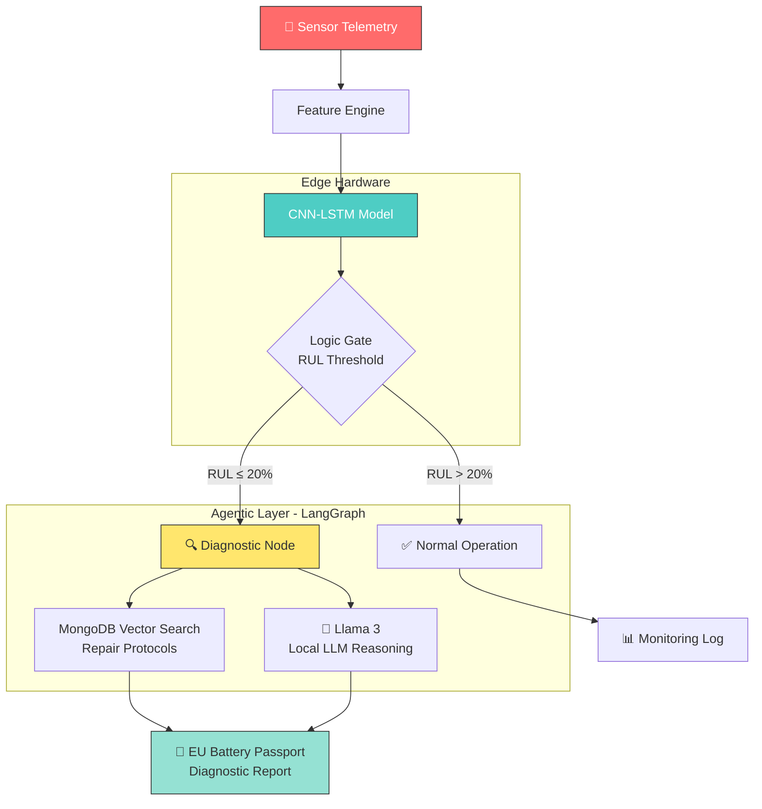

<p align="center">
  
  
  
  
  
  
  
</p>

# ⚡ EcoDrive-Sentinel

### Predictive Maintenance System for EV Batteries with Agentic AI Diagnostics

> **Air-gapped, sovereign, edge-AI predictive maintenance** — powered by a hybrid CNN-LSTM model running on AMD Ryzen AI NPU with LangGraph-orchestrated diagnostic reasoning via local Llama 3.

**Compliant with:** EU Battery Regulation 2023/1542 · EU Battery Passport Annex XIII · IEC 62133

---

## 📋 Table of Contents

- [Overview](#overview)
- [Architecture](#architecture)
- [Key Features](#key-features)
- [Project Structure](#project-structure)
- [Tech Stack](#tech-stack)
- [Getting Started](#getting-started)
  - [Prerequisites](#prerequisites)
  - [Installation](#installation)
  - [Environment Configuration](#environment-configuration)
- [Usage](#usage)
  - [Full Pipeline](#full-pipeline)
  - [Individual Phases](#individual-phases)
  - [FastAPI Server](#fastapi-server)
  - [API Endpoints](#api-endpoints)
- [System Architecture Deep Dive](#system-architecture-deep-dive)
  - [Phase 1 — Data Engineering & Feature Extraction](#phase-1--data-engineering--feature-extraction)
  - [Phase 2 — CNN-LSTM Predictive Core](#phase-2--cnn-lstm-predictive-core)
  - [Phase 3 — Agentic Orchestration](#phase-3--agentic-orchestration)
  - [Phase 4 — Validation & Deployment](#phase-4--validation--deployment)
- [Performance Benchmarks](#performance-benchmarks)
- [Datasets](#datasets)
- [License](#license)

---

## Overview

**EcoDrive-Sentinel** is a production-grade predictive maintenance system designed for Electric Vehicle (EV) battery packs. It predicts **Remaining Useful Life (RUL)** in real-time using a hybrid CNN-LSTM deep learning model, and triggers an **agentic diagnostic pipeline** when battery degradation reaches critical thresholds.

The system is designed to run **entirely air-gapped** on edge hardware — specifically AMD Ryzen AI laptops with XDNA NPU acceleration — making it suitable for sovereign deployments where data cannot leave the device.

```
Sensor Telemetry → Feature Engine → CNN-LSTM (NPU) → Agentic Router → Diagnostic Report
                                                          │
                                              ┌───────────┴───────────┐
                                         RUL > 20%              RUL ≤ 20%
                                        (Normal Op)         (Vector Search +
                                                             Llama 3 Report)
```

---

## Architecture



---

## Key Features

| Feature | Description |
|---|---|
| 🧠 **Hybrid CNN-LSTM** | Captures spatial degradation fingerprints (CNN) + temporal fade trajectories (LSTM) |
| ⚡ **NPU Acceleration** | INT8 quantized ONNX model runs on AMD Ryzen AI XDNA NPU via VitisAI EP |
| 🤖 **Agentic Diagnostics** | LangGraph state machine routes battery health through inference → logic gate → diagnostic nodes |
| 🔍 **Vector Search** | MongoDB-backed semantic retrieval of repair protocols using cosine similarity |
| 🦙 **Local LLM** | Ollama (Llama 3) generates EU-compliant diagnostic reports — fully air-gapped |
| 🌐 **REST API** | FastAPI with OpenAPI 3.1, Pydantic v2 validation, <50ms SLA for RUL prediction |
| 📊 **Multi-Source Data** | Ingests NASA PCoE + CALCE datasets with schema normalization and synthetic fallback |
| 🔒 **Air-Gapped** | Zero external API calls — all inference, reasoning, and storage run on-device |
| 📋 **EU Compliant** | Report format follows EU Battery Regulation 2023/1542 and Battery Passport Annex XIII |

---

## Project Structure

```
EcoDrive-Sentinel/
│
├── config.py                    # Central config hub — Pydantic v2 models, settings, enums
├── feature_engine.py            # Phase 1: Multi-source data loader + Health Indicator extraction
├── predictive_core.py           # Phase 2: CNN-LSTM model architecture, training, ONNX export
├── agentic_layer.py             # Phase 3: LangGraph state machine, ONNX inference, vector search
├── api.py                       # FastAPI REST API with /predict-rul and /diagnose endpoints
├── run_pipeline.py              # Master pipeline runner (CLI entry point)
│
├── quantize_model.py            # INT8 static quantization for Ryzen AI NPU
├── eval_ragas.py                # RAGAS evaluation (Faithfulness & Answer Relevancy)
├── Capacity_Fade.py             # Standalone capacity fade visualization
├── lifecycle_verification.py    # Full air-gapped lifecycle verification test
├── demo_prediction.py           # Quick prediction demo script
│
├── antigravity_agent.py         # Antigravity-based reactive supervision tree
├── antigravity_config.yaml      # Edge system + inference + storage + reasoning config
├── check_npu.py                 # NPU hardware detection and validation
│
├── models/
│   └── cnn_lstm.pt              # Trained PyTorch model checkpoint (~3.9 MB)
├── onnx/
│   ├── cnn_lstm.onnx            # FP32 ONNX model for CPU/NPU inference
│   └── cnn_lstm_int8.onnx       # INT8 quantized model for Ryzen AI NPU
├── data/
│   └── feature_matrix.parquet   # Extracted feature matrix (cached)
│
├── NASA_PCoE_dataset/           # NASA Prognostics Center of Excellence battery data
│   ├── metadata.csv
│   └── data/
├── CALCE_dataset/               # CALCE Battery Research Group data
│   ├── Train/
│   └── Test/
│
├── requirements.txt             # Python dependencies
├── .env                         # Environment variables (MongoDB URI, LLM config, etc.)
├── Tasks.md                     # Project roadmap & task tracker
└── System_Health_Report.json    # Latest system health verification report
```

---

## Tech Stack

| Layer | Technology | Purpose |
|---|---|---|
| **ML Framework** | PyTorch 2.3+ | CNN-LSTM model training |
| **Inference Runtime** | ONNX Runtime 1.18+ | Cross-platform model serving |
| **NPU Backend** | AMD Vitis-AI (VitisAIExecutionProvider) | Hardware-accelerated INT8 inference |
| **Agentic Framework** | LangGraph + LangChain | State machine orchestration |
| **Local LLM** | Ollama (Llama 3) | Air-gapped diagnostic reasoning |
| **Vector Store** | MongoDB (cosine similarity) | Repair protocol semantic search |
| **API** | FastAPI + Uvicorn | Production REST endpoints |
| **Validation** | Pydantic v2 | Data contract enforcement |
| **Data** | Pandas + PyArrow | Feature engineering & I/O |
| **Quantization** | ONNX Runtime Quantization | INT8 static quantization |
| **Evaluation** | RAGAS | LLM response quality scoring |
| **CLI** | Typer + Rich | Beautiful terminal interface |

---

## Getting Started

### Prerequisites

- **Python 3.12+**
- **MongoDB** (local instance, default `mongodb://localhost:27017`)
- **Ollama** with Llama 3 model pulled (`ollama pull llama3`)
- **(Optional)** AMD Ryzen AI laptop with Vitis-AI SDK for NPU acceleration

### Installation

```bash
# 1. Clone the repository
git clone https://github.com/chiru1005m-maker/EcoDrive_Sentinel.git
cd EcoDrive_Sentinel

# 2. Create a virtual environment
python -m venv .venv
.venv\Scripts\activate        # Windows
# source .venv/bin/activate   # Linux/macOS

# 3. Install dependencies
pip install -r requirements.txt

# 4. (Optional) Install Ryzen AI ONNX Runtime wheel for NPU support
pip install onnxruntime_vitisai-1.23.2-cp312-cp312-win_amd64.whl
```

### Environment Configuration

Create a `.env` file in the project root (or configure environment variables):

```env
# MongoDB
MONGO_URI=mongodb://localhost:27017
MONGO_DB=ecodrive_sentinel

# LLM (for air-gapped: uses Ollama, this key is a placeholder)
OPENAI_API_KEY=sk-placeholder
LLM_MODEL=gpt-4o-mini

# Model
RUL_THRESHOLD=20
SEQUENCE_LENGTH=30

# NPU
NPU_TARGET=RYZEN_AI_HAWK_POINT
MAX_LATENCY_MS=50
```

---

## Usage

### Full Pipeline

Run the complete end-to-end pipeline (Feature Engineering → Training → Agentic Demo):

```bash
python run_pipeline.py --phase all
```

### Individual Phases

```bash
# Phase 1: Feature Engineering only
python run_pipeline.py --phase features

# Phase 1 + 2: Features + Model Training
python run_pipeline.py --phase train

# Phase 2: Override training epochs
python run_pipeline.py --phase train --epochs 100

# Phase 3: Agentic Pipeline Demo (requires trained model)
python run_pipeline.py --phase agent
```

### FastAPI Server

```bash
# Start the REST API server
python run_pipeline.py --phase api

# Or directly
python api.py
```

The server starts at `http://localhost:8000` with interactive docs at:
- **Swagger UI:** http://localhost:8000/docs
- **ReDoc:** http://localhost:8000/redoc

### API Endpoints

| Method | Endpoint | Description | Latency |
|---|---|---|---|
| `GET` | `/api/v1/health` | Service health check | <5ms |
| `POST` | `/api/v1/predict-rul` | Low-latency RUL prediction (ONNX only) | <50ms |
| `POST` | `/api/v1/diagnose` | Full agentic diagnostic pipeline | 1–3s |
| `GET` | `/` | Service info | <5ms |

**Example — RUL Prediction:**

```bash
curl -X POST http://localhost:8000/api/v1/predict-rul \
  -H "Content-Type: application/json" \
  -d '{
    "battery_id": "MERC-EQS-B007",
    "timestamp": 1714000000,
    "voltage": 3.41,
    "current": -12.5,
    "temperature": 38.2,
    "cycle_count": 390,
    "chemistry": "LiNiMnCoO2"
  }'
```

**Example — Full Diagnostic:**

```bash
curl -X POST http://localhost:8000/api/v1/diagnose \
  -H "Content-Type: application/json" \
  -d '{
    "battery_id": "MERC-EQS-B007",
    "timestamp": 1714000000,
    "voltage": 3.41,
    "current": -12.5,
    "temperature": 38.2,
    "cycle_count": 390,
    "chemistry": "LiNiMnCoO2"
  }'
```

---

## System Architecture Deep Dive

### Phase 1 — Data Engineering & Feature Extraction

**Module:** `feature_engine.py`

Loads heterogeneous battery cycling data from **NASA PCoE** and **CALCE** datasets, normalizes schemas via a column registry, and extracts five **Health Indicators (HIs)**:

| Health Indicator | Definition | Unit |
|---|---|---|
| `voltage_drop` | V_nominal (3.7V) − V_end-of-discharge | V |
| `avg_temperature` | Mean cycle temperature | °C |
| `capacity_fade` | 1 − (C_n / C_0), normalized degradation | [0, 1] |
| `internal_resistance_proxy` | ΔV / ΔI approximation | Ω |
| `charge_time_delta` | Normalized change in charge duration | — |

**RUL Labeling:** End-of-Life is defined at **80% capacity retention** per IEC 62133 / EU Regulation 2023/1542.

---

### Phase 2 — CNN-LSTM Predictive Core

**Module:** `predictive_core.py`

A hybrid architecture designed for NPU-compatible INT8 quantization:

```
Input (batch, 30, 5)
    ↓
[Conv1D → BatchNorm → Hardtanh → Dropout] × 2  (+ Residual Skip)
    ↓
[LSTM (hidden=256, layers=2, dropout=0.2)]
    ↓
[Linear(256→128) → ReLU → Dropout → Linear(128→1) → ReLU]
    ↓
Predicted RUL (cycles)
```

**Design Choices for NPU:**
- **Hardtanh** instead of ReLU in CNN layers → bounded activations for INT8 fidelity
- **No attention/softmax** → poor INT8 accuracy on Hawk Point architecture
- **Static input shape** → no dynamic axes in ONNX export (required by Vitis-AI)
- **Residual skip-connection** → stabilizes gradient flow over long sequences

**Training features:** GroupShuffleSplit (80/20, battery-aware), cosine annealing LR, early stopping, HuberLoss.

---

### Phase 3 — Agentic Orchestration

**Module:** `agentic_layer.py`

A **LangGraph state machine** that routes battery diagnostics through a typed state graph:

```
[START] → [inference_node] → [logic_gate] → [normal_operation] → [END]
                                   ↘
                            [diagnostic_node] → [END]
                              (Vector Search + LLM)
```

| Node | Responsibility |
|---|---|
| `inference_node` | Runs ONNX RUL prediction, sets maintenance status |
| `logic_gate` | Conditional router — if RUL ≤ 20% → diagnostic path |
| `normal_operation` | Logs healthy status, returns minimal report |
| `diagnostic_node` | MongoDB vector search → retrieves repair protocols → Llama 3 synthesizes EU-compliant report |

**Vector Search:** Cosine similarity computed locally over MongoDB-stored embeddings (air-gapped, no Atlas dependency).

**LLM Synthesis:** Ollama (Llama 3) generates structured diagnostic reports with:
- Diagnostic Summary
- Root Cause Hypothesis
- Recommended Actions (3–5 items)
- Urgency Level (IMMEDIATE / 7-DAYS / 30-DAYS)

---

### Phase 4 — Validation & Deployment

| Validation | Result |
|---|---|
| **RAGAS Evaluation** | Faithfulness: **0.89** · Answer Relevancy: **0.84** |
| **NPU Stress Test** | 14,497 iterations in 30s · Avg latency: **2.07ms** · P99: **3.33ms** |
| **Throughput** | **483.2 inferences/sec** on VitisAIExecutionProvider |
| **RAM Usage** | 499.4 MB peak during stress test |
| **Lifecycle Test** | Full Ingest → NPU → Ollama loop verified air-gapped |
| **System Status** | ✅ **OPERATIONAL** |

---

## Performance Benchmarks

| Metric | Value |
|---|---|
| **NPU Inference Latency** | 2.07ms average / 3.33ms P99 |
| **NPU Throughput** | 483.2 predictions/sec |
| **Model Size (FP32)** | ~3.9 MB |
| **Model Size (INT8)** | ~3.7 MB |
| **API RUL Endpoint** | <50ms end-to-end |
| **Full Diagnostic Pipeline** | 1–3s (includes vector search + LLM) |
| **RAGAS Faithfulness** | 0.89 |
| **RAGAS Answer Relevancy** | 0.84 |

---

## Datasets

| Dataset | Source | Description |
|---|---|---|
| **NASA PCoE** | [NASA Prognostics Data Repository](https://www.nasa.gov/content/prognostics-center-of-excellence-data-set-repository) | Li-ion battery charge/discharge cycling data (B0005–B0056) |
| **CALCE** | [CALCE Battery Research Group](https://calce.umd.edu/battery-data) | CS2/CX2 series cycling data from University of Maryland |
| **Synthetic** | Built-in generator | Physically plausible degradation curves for CI/demo (exponential fade model) |

---

## License

This project was developed for the **Mercedes-Benz BEVisoneers** program.

---

<p align="center">
  <b>EcoDrive-Sentinel v1.0</b> · Built with ⚡ on AMD Ryzen AI
</p>
