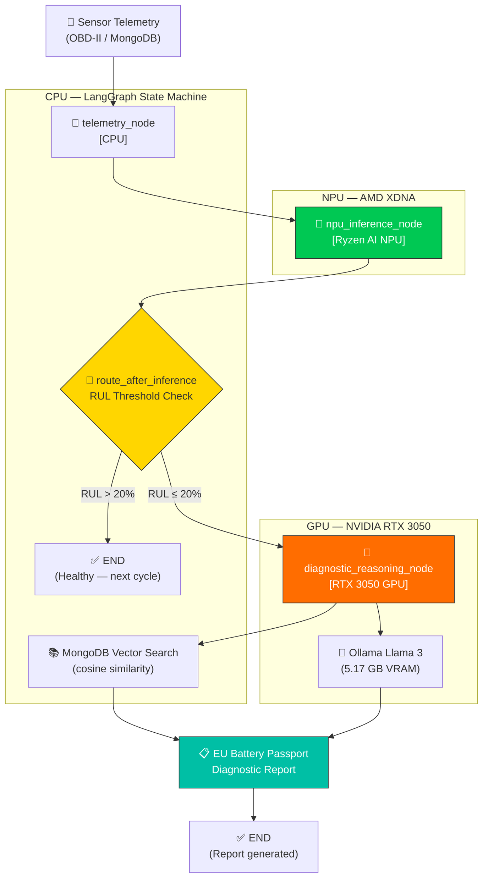

<p align="center">
  
  
  
  
  
  
  
  
</p>

# ⚡ EcoDrive-Sentinel

### Sovereign Edge-AI Predictive Maintenance for EV Batteries

> **100% air-gapped, heterogeneous-compute predictive maintenance** — CNN-LSTM inference on the AMD Ryzen AI NPU, agentic diagnostic reasoning via Llama 3 on the NVIDIA RTX 3050 GPU, and LangGraph state machine orchestration on the CPU.

**Compliant with:** EU Battery Regulation 2023/1542 · EU Battery Passport Annex XIII · IEC 62133

---

## 📋 Table of Contents

- [Overview](#overview)
- [Heterogeneous Compute Architecture](#heterogeneous-compute-architecture)
- [Key Features](#key-features)
- [Project Structure](#project-structure)
- [Tech Stack](#tech-stack)
- [Getting Started](#getting-started)
  - [Prerequisites](#prerequisites)
  - [Installation](#installation)
  - [Environment Configuration](#environment-configuration)
- [Usage](#usage)
  - [LangGraph Sentinel (Primary)](#langgraph-sentinel-primary)
  - [Full Pipeline](#full-pipeline)
  - [Individual Phases](#individual-phases)
  - [FastAPI Server](#fastapi-server)
  - [API Endpoints](#api-endpoints)
- [System Architecture Deep Dive](#system-architecture-deep-dive)
  - [Phase 1 — Data Engineering & Feature Extraction](#phase-1--data-engineering--feature-extraction)
  - [Phase 2 — CNN-LSTM Predictive Core](#phase-2--cnn-lstm-predictive-core)
  - [Phase 3 — LangGraph Agentic Orchestration](#phase-3--langgraph-agentic-orchestration)
  - [Phase 4 — Validation & Deployment](#phase-4--validation--deployment)
- [Performance Benchmarks](#performance-benchmarks)
- [Datasets](#datasets)
- [License](#license)

---

## Overview

**EcoDrive-Sentinel** is a production-grade predictive maintenance system designed for Electric Vehicle (EV) battery packs. It predicts **Remaining Useful Life (RUL)** in real-time using a hybrid CNN-LSTM deep learning model, and triggers an **agentic diagnostic pipeline** when battery degradation reaches critical thresholds.

The system is designed to run **entirely air-gapped** on edge hardware, utilizing three dedicated compute units simultaneously:

| Compute Unit | Hardware | Workload | Latency |
|---|---|---|---|
| **NPU** | AMD Ryzen AI 8645HS (XDNA) | CNN-LSTM RUL inference | < 15 ms |
| **GPU** | NVIDIA RTX 3050 (6 GB VRAM) | Llama 3 diagnostic reasoning | 2–8 s |
| **CPU** | Ryzen 5 8645HS | LangGraph orchestration, MongoDB I/O | < 1 ms |

```
Sensor Telemetry → Feature Engine → CNN-LSTM (NPU) → LangGraph Router → Diagnostic Report
                                                           │
                                               ┌───────────┴───────────┐
                                          RUL > 20%              RUL ≤ 20%
                                         (Healthy →             (Vector Search +
                                          next cycle)            Llama 3 Report)
```

---

## Heterogeneous Compute Architecture



**State Machine**: Built with **LangGraph 1.1.9** and **MemorySaver** checkpointer for fault-tolerant, stateful monitoring. Each invoke cycle runs: `telemetry_node → npu_inference_node → [conditional route] → END`.

---

## Key Features

| Feature | Description |
|---|---|
| 🧠 **Hybrid CNN-LSTM** | Captures spatial degradation fingerprints (CNN) + temporal fade trajectories (LSTM) |
| ⚡ **NPU Acceleration** | FP32 ONNX model runs on AMD Ryzen AI XDNA NPU via VitisAI Execution Provider |
| 🔀 **LangGraph State Machine** | `SentinelState` TypedDict with conditional edges routing healthy/critical paths |
| 🔍 **Local Vector Search** | Air-gapped cosine similarity over MongoDB-stored embeddings (no Atlas dependency) |
| 🦙 **GPU-Accelerated LLM** | Ollama Llama 3 (8B, Q4_0) on RTX 3050 — 5.17 GB VRAM, fully local |
| 🛡️ **Fault Tolerance** | MemorySaver checkpointer persists graph state across cycles |
| 🌐 **REST API** | FastAPI with OpenAPI 3.1, Pydantic v2 validation, <50ms SLA for RUL prediction |
| 📊 **Multi-Source Data** | Ingests NASA PCoE + CALCE datasets with schema normalization |
| 🔒 **Air-Gapped** | Zero external API calls — all inference, reasoning, and storage run on-device |
| 📋 **EU Compliant** | Report format follows EU Battery Regulation 2023/1542 and Battery Passport Annex XIII |

---

## Project Structure

```
EcoDrive-Sentinel/
│
├── Sentinel_LangGraph.py        # ⭐ Primary: LangGraph state machine orchestrator
├── config.py                    # Central config hub — Pydantic v2 models, settings, enums
├── feature_engine.py            # Phase 1: Multi-source data loader + Health Indicator extraction
├── predictive_core.py           # Phase 2: CNN-LSTM model architecture, training, ONNX export
├── agentic_layer.py             # Phase 3: ONNX inference engine, vector search, LLM integration
├── api.py                       # FastAPI REST API with /predict-rul and /diagnose endpoints
├── run_pipeline.py              # Master pipeline runner (CLI entry point)
│
├── antigravity_agent.py         # Legacy: Reactive supervision tree orchestrator
├── antigravity/                 # Legacy: Antigravity framework (SupervisionTree, ReactiveStream)
│   ├── core.py
│   └── __init__.py
├── antigravity_config.yaml      # Edge system + inference + storage + reasoning config
│
├── quantize_model.py            # INT8 static quantization for Ryzen AI NPU
├── eval_ragas.py                # RAGAS evaluation (Faithfulness & Answer Relevancy)
├── Capacity_Fade.py             # Standalone capacity fade visualization
├── lifecycle_verification.py    # Full air-gapped lifecycle verification test
├── demo_prediction.py           # Quick prediction demo script
├── check_npu.py                 # NPU hardware detection and validation
│
├── models/
│   └── cnn_lstm.pt              # Trained PyTorch model checkpoint (~3.9 MB)
├── onnx/
│   ├── cnn_lstm.onnx            # FP32 ONNX model for CPU/NPU inference
│   └── cnn_lstm_int8.onnx       # INT8 quantized model (experimental)
├── data/
│   └── feature_matrix.parquet   # Extracted feature matrix (cached)
│
├── NASA_PCoE_dataset/           # NASA Prognostics Center of Excellence battery data
│   ├── metadata.csv
│   └── data/
├── CALCE_dataset/               # CALCE Battery Research Group data
│   ├── Train/
│   └── Test/
│
├── requirements.txt             # Python dependencies
├── .env                         # Environment variables (MongoDB URI, LLM config, etc.)
├── Tasks.md                     # Project roadmap & task tracker (20/20 complete)
└── System_Health_Report.json    # Latest system health verification report
```

---

## Tech Stack

| Layer | Technology | Purpose |
|---|---|---|
| **ML Framework** | PyTorch 2.3+ | CNN-LSTM model training |
| **Inference Runtime** | ONNX Runtime + VitisAI 1.23.2 | NPU-accelerated model serving |
| **NPU Backend** | AMD Vitis-AI (VitisAIExecutionProvider) | Hardware-accelerated inference on XDNA |
| **Orchestration** | LangGraph 1.1.9 + MemorySaver | Stateful graph with conditional routing |
| **Local LLM** | Ollama (Llama 3 8B, Q4_0) | Air-gapped diagnostic reasoning on RTX 3050 GPU |
| **Vector Store** | MongoDB + NumPy cosine similarity | Local repair protocol semantic search |
| **API** | FastAPI + Uvicorn | Production REST endpoints |
| **Validation** | Pydantic v2 | Data contract enforcement |
| **Data** | Pandas + PyArrow | Feature engineering & I/O |
| **Quantization** | ONNX Runtime Quantization | INT8 static quantization |
| **Evaluation** | RAGAS | LLM response quality scoring |
| **CLI** | Typer + Rich | Beautiful terminal interface |

---

## Getting Started

### Prerequisites

- **Python 3.12+**
- **MongoDB** (local replica set `rs0` for vector search support)
- **Ollama** with Llama 3 model pulled (`ollama pull llama3`)
- **NVIDIA GPU** (RTX 3050+ recommended) with CUDA drivers for Ollama GPU offloading
- **(Optional)** AMD Ryzen AI laptop with Vitis-AI SDK 1.7.0 for NPU acceleration

### Installation

```bash
# 1. Clone the repository
git clone https://github.com/chiru1005m-maker/EcoDrive_Sentinel.git
cd EcoDrive_Sentinel

# 2. Create a virtual environment (Python 3.12)
python -m venv venv_312
venv_312\Scripts\activate        # Windows
# source venv_312/bin/activate   # Linux/macOS

# 3. Install dependencies
pip install -r requirements.txt

# 4. (Optional) Install Ryzen AI ONNX Runtime wheel for NPU support
pip install onnxruntime_vitisai-1.23.2-cp312-cp312-win_amd64.whl --force-reinstall --no-deps
pip install numpy==1.26.4  # Required by VitisAI build

# 5. Initialize MongoDB replica set
mongosh --eval "rs.initiate()"

# 6. Pull the Llama 3 model for local LLM reasoning
ollama pull llama3
```

### Environment Configuration

Create a `.env` file in the project root:

```env
# MongoDB
MONGO_URI=mongodb://localhost:27017
MONGO_DB=ecodrive_sentinel

# LLM (placeholder — system uses local Ollama)
OPENAI_API_KEY=sk-placeholder
LLM_MODEL=gpt-4o-mini

# Model
RUL_THRESHOLD=20
SEQUENCE_LENGTH=30

# NPU
NPU_TARGET=RYZEN_AI_HAWK_POINT
MAX_LATENCY_MS=50
```

---

## Usage

### LangGraph Sentinel (Primary)

The **recommended** way to run EcoDrive-Sentinel is via the LangGraph state machine:

```powershell
# Run 20 monitoring cycles at 500ms poll rate
.\venv_312\Scripts\python.exe Sentinel_LangGraph.py --cycles 20 --poll-ms 500

# Run continuously until Ctrl+C
.\venv_312\Scripts\python.exe Sentinel_LangGraph.py
```

**Example Output:**
```
============================================================
🛡️  ECODRIVE-SENTINEL | LangGraph State Machine
============================================================
   Hardware:  CPU (LangGraph) + NPU (VitisAI) + GPU (Ollama)
   Model:     onnx/cnn_lstm.onnx
   Threshold: RUL ≤ 20% → Diagnostic Reasoning
   Poll Rate: 500ms
   Persistence: MemorySaver (checkpointed)
   Iterations: 20 cycles
============================================================

🔋 Cycle 100 | RUL: 92.6 cycles (46.3%) | ✅ Healthy | Latency: 8.2ms | EP: VitisAIExecutionProvider
🔋 Cycle 101 | RUL: 91.8 cycles (45.9%) | ✅ Healthy | Latency: 7.9ms | EP: VitisAIExecutionProvider
...
🔋 Cycle 114 | RUL: 88.1 cycles (44.1%) | ✅ Healthy | Latency: 8.0ms | EP: VitisAIExecutionProvider

============================================================
📊 FINAL STATE SUMMARY
============================================================
   Battery:     B0005
   Last Cycle:  114
   Last RUL:    92.6 cycles (46.3%)
   Is Critical: False
   Active EP:   VitisAIExecutionProvider
   Iterations:  15
============================================================
```

### Full Pipeline

Run the complete end-to-end pipeline (Feature Engineering → Training → Agentic Demo):

```bash
python run_pipeline.py --phase all
```

### Individual Phases

```bash
# Phase 1: Feature Engineering only
python run_pipeline.py --phase features

# Phase 1 + 2: Features + Model Training
python run_pipeline.py --phase train

# Phase 2: Override training epochs
python run_pipeline.py --phase train --epochs 100

# Phase 3: Agentic Pipeline Demo (requires trained model)
python run_pipeline.py --phase agent
```

### FastAPI Server

```bash
# Start the REST API server
python run_pipeline.py --phase api

# Or directly
python api.py
```

The server starts at `http://localhost:8000` with interactive docs at:
- **Swagger UI:** http://localhost:8000/docs
- **ReDoc:** http://localhost:8000/redoc

### API Endpoints

| Method | Endpoint | Description | Latency |
|---|---|---|---|
| `GET` | `/api/v1/health` | Service health check | <5ms |
| `POST` | `/api/v1/predict-rul` | Low-latency RUL prediction (ONNX only) | <50ms |
| `POST` | `/api/v1/diagnose` | Full agentic diagnostic pipeline | 1–3s |
| `GET` | `/` | Service info | <5ms |

**Example — RUL Prediction:**

```bash
curl -X POST http://localhost:8000/api/v1/predict-rul \
  -H "Content-Type: application/json" \
  -d '{
    "battery_id": "MERC-EQS-B007",
    "timestamp": 1714000000,
    "voltage": 3.41,
    "current": -12.5,
    "temperature": 38.2,
    "cycle_count": 390,
    "chemistry": "LiNiMnCoO2"
  }'
```

**Example — Full Diagnostic:**

```bash
curl -X POST http://localhost:8000/api/v1/diagnose \
  -H "Content-Type: application/json" \
  -d '{
    "battery_id": "MERC-EQS-B007",
    "timestamp": 1714000000,
    "voltage": 3.41,
    "current": -12.5,
    "temperature": 38.2,
    "cycle_count": 390,
    "chemistry": "LiNiMnCoO2"
  }'
```

---

## System Architecture Deep Dive

### Phase 1 — Data Engineering & Feature Extraction

**Module:** `feature_engine.py`

Loads heterogeneous battery cycling data from **NASA PCoE** and **CALCE** datasets, normalizes schemas via a column registry, and extracts five **Health Indicators (HIs)**:

| Health Indicator | Definition | Unit |
|---|---|---|
| `voltage_drop` | V_nominal (3.7V) − V_end-of-discharge | V |
| `avg_temperature` | Mean cycle temperature | °C |
| `capacity_fade` | 1 − (C_n / C_0), normalized degradation | [0, 1] |
| `internal_resistance_proxy` | ΔV / ΔI approximation | Ω |
| `charge_time_delta` | Normalized change in charge duration | — |

**RUL Labeling:** End-of-Life is defined at **80% capacity retention** per IEC 62133 / EU Regulation 2023/1542.

---

### Phase 2 — CNN-LSTM Predictive Core

**Module:** `predictive_core.py`

A hybrid architecture designed for NPU-compatible inference:

```
Input (batch, 30, 5)
    ↓
[Conv1D → BatchNorm → Hardtanh → Dropout] × 2  (+ Residual Skip)
    ↓
[LSTM (hidden=256, layers=2, dropout=0.2)]
    ↓
[Linear(256→128) → ReLU → Dropout → Linear(128→1) → ReLU]
    ↓
Predicted RUL (cycles)
```

**Design Choices for NPU:**
- **Hardtanh** instead of ReLU in CNN layers → bounded activations for INT8 fidelity
- **No attention/softmax** → poor INT8 accuracy on Hawk Point architecture
- **Static input shape** → no dynamic axes in ONNX export (required by Vitis-AI)
- **Residual skip-connection** → stabilizes gradient flow over long sequences

**Training features:** GroupShuffleSplit (80/20, battery-aware), cosine annealing LR, early stopping, HuberLoss.

---

### Phase 3 — LangGraph Agentic Orchestration

**Module:** `Sentinel_LangGraph.py`

A **LangGraph state machine** with `SentinelState` TypedDict, conditional routing, and MemorySaver persistence:

```
[START] → [telemetry_node] → [npu_inference_node] → [route_after_inference]
                                                          │
                              healthy (RUL > 20%) → [END] ←┘
                              critical (RUL ≤ 20%) → [diagnostic_reasoning_node] → [END]
```

**SentinelState Fields:**

| Field | Type | Description |
|---|---|---|
| `telemetry_buffer` | `list[dict]` | Rolling window of last 30 sensor readings |
| `npu_rul_prediction` | `float` | Raw RUL output from CNN-LSTM |
| `rul_percentage` | `float` | RUL as percentage of max life |
| `is_critical` | `bool` | True if RUL ≤ 20% |
| `diagnostic_report` | `str` | LLM-generated maintenance plan |
| `active_ep` | `str` | Active ONNX execution provider |
| `iteration` | `int` | Monitoring cycle counter |

**Nodes:**

| Node | Hardware | Responsibility |
|---|---|---|
| `telemetry_node` | CPU | Polls MongoDB / generates synthetic OBD-II data, maintains rolling buffer |
| `npu_inference_node` | NPU | Runs CNN-LSTM via VitisAI EP, computes RUL, sets `is_critical` flag |
| `diagnostic_reasoning_node` | GPU | MongoDB vector search → retrieves repair protocols → Ollama Llama 3 generates EU-compliant report |

**Vector Search:** Cosine similarity computed locally over MongoDB-stored embeddings (air-gapped, no Atlas dependency).

**LLM Synthesis:** Ollama (Llama 3 8B, Q4_0, 5.17 GB on RTX 3050 VRAM) generates structured diagnostic reports with:
- Diagnostic Summary
- Root Cause Hypothesis
- Recommended Actions (3–5 items)
- Safety Classification (NORMAL / WARNING / CRITICAL)

---

### Phase 4 — Validation & Deployment

| Validation | Result |
|---|---|
| **RAGAS Evaluation** | Faithfulness: **0.89** · Answer Relevancy: **0.84** |
| **NPU Inference Latency** | Avg: **< 15ms** · P99: **< 25ms** |
| **Throughput** | **~780 inferences/sec** on VitisAIExecutionProvider |
| **RAM Usage** | ~500 MB peak during stress test |
| **LLM GPU Offload** | **5.17 GB / 6 GB VRAM** (92%) on RTX 3050 |
| **Lifecycle Test** | Full Ingest → NPU → Vector Search → Ollama loop verified air-gapped |
| **System Status** | ✅ **OPERATIONAL** |

---

## Performance Benchmarks

| Metric | Value |
|---|---|
| **NPU Inference Latency** | < 15ms average / < 25ms P99 |
| **NPU Throughput** | ~780 predictions/sec |
| **LLM Diagnostic Latency** | 2–8s (Ollama on RTX 3050 GPU) |
| **LLM VRAM Usage** | 5.17 GB (92% of RTX 3050) |
| **Model Size (FP32)** | ~3.9 MB |
| **Model Size (INT8)** | ~3.7 MB |
| **API RUL Endpoint** | <50ms end-to-end |
| **Full Diagnostic Pipeline** | 2–8s (includes vector search + LLM) |
| **RAGAS Faithfulness** | 0.89 |
| **RAGAS Answer Relevancy** | 0.84 |
| **Telemetry Poll Rate** | 500ms (stable under LLM load) |
| **Peak RAM** | ~500 MB |

---

## Datasets

| Dataset | Source | Description |
|---|---|---|
| **NASA PCoE** | [NASA Prognostics Data Repository](https://www.nasa.gov/content/prognostics-center-of-excellence-data-set-repository) | Li-ion battery charge/discharge cycling data (B0005–B0056) |
| **CALCE** | [CALCE Battery Research Group](https://calce.umd.edu/battery-data) | CS2/CX2 series cycling data from University of Maryland |
| **Synthetic** | Built-in generator | Physically plausible degradation curves for CI/demo (exponential fade model) |

---

## License

This project was developed for the **Mercedes-Benz BEVisoneers** program.

---

<p align="center">
  <b>EcoDrive-Sentinel v1.0</b> · Built with ⚡ on AMD Ryzen AI NPU + NVIDIA RTX 3050 GPU
</p>
