# EcoDrive-Sentinel | Professional File Registry

**Project:** EcoDrive-Sentinel v1.0 — Predictive Maintenance for EV Batteries  
**Total Assets:** 68 files across 13 directories  
**Registry Date:** 2026-05-15  
**Compliance:** EU Battery Regulation 2023/1542 · Battery Passport Annex XIII

---

## Registry Overview

```mermaid
graph TD
    ROOT["ML Project/"] --> CORE["🧠 Predictive Core"]
    ROOT --> AGENT["🤖 Agentic Orchestration"]
    ROOT --> DATA["📊 Data & Knowledge"]
    ROOT --> UTIL["🔧 Utility & Health"]
    ROOT --> ENV["⚙️ Environment"]
    ROOT --> REF["📚 Reference"]

    CORE --> PC["predictive_core.py"]
    CORE --> QM["quantize_model.py"]
    CORE --> FE["feature_engine.py"]
    CORE --> ONNX["onnx/"]

    AGENT --> AL["agentic_layer.py"]
    AGENT --> SL["Sentinel_LangGraph.py"]
    AGENT --> AA["antigravity_agent.py"]
    AGENT --> AC["antigravity_core.py"]

    DATA --> NASA["NASA_PCoE_dataset/"]
    DATA --> CALCE["CALCE_dataset/"]
    DATA --> MC["14× MC-*.pdf"]
    DATA --> MAT["4× .mat files"]

    UTIL --> API["api.py"]
    UTIL --> AM["audit_mongo.py"]
    UTIL --> SHR["System_Health_Report.json"]
    UTIL --> LV["lifecycle_verification.py"]

    ENV --> VENV["venv_312/"]
    ENV --> REQ["requirements.txt"]
    ENV --> DOTENV[".env"]
```



---

## 1. 🧠 The Predictive Core

> **Purpose:** End-to-end deep learning pipeline — from raw battery telemetry to ONNX-optimized RUL predictions deployable on AMD Ryzen AI NPU hardware.

| File | Size | Engineering Justification |
|---|---|---|
| [predictive_core.py](file:///c:/Users/Chiranjeevi%20Chiranth/OneDrive/Desktop/ML%20Project/predictive_core.py) | 24.5 KB | Implements the **1D Dilated CNN-LSTM regressor** (dilation rates 1,2,4), `ModelTrainer` with battery-aware cross-validation, and `export_to_onnx()` with 16-key metadata embedding for NPU provenance tracking. |
| [feature_engine.py](file:///c:/Users/Chiranjeevi%20Chiranth/OneDrive/Desktop/ML%20Project/feature_engine.py) | 24.9 KB | Transforms raw NASA PCoE and CALCE discharge CSVs into a **5-feature Health Indicator matrix** (avg_voltage, avg_temp, max_temp, capacity, capacity_fade) with per-cycle aggregation and RUL label computation (EOL = 80% capacity). |
| [quantize_model.py](file:///c:/Users/Chiranjeevi%20Chiranth/OneDrive/Desktop/ML%20Project/quantize_model.py) | 3.0 KB | Performs **INT8 post-training quantization** (QDQ format) of the ONNX model using AMD Vitis AI Quantizer, producing the NPU-deployable `cnn_lstm_int8.onnx` with calibration data from the training set. |
| [config.py](file:///c:/Users/Chiranjeevi%20Chiranth/OneDrive/Desktop/ML%20Project/config.py) | 8.4 KB | Centralizes all **Pydantic-validated settings**, data paths (`NASA_DIR`, `CALCE_DIR`), `SensorReading` schema, and `ChemistryType` enums — the single source of truth for system configuration. |
| [run_pipeline.py](file:///c:/Users/Chiranjeevi%20Chiranth/OneDrive/Desktop/ML%20Project/run_pipeline.py) | 7.1 KB | **Master CLI entry point** (`typer`) orchestrating Phase 1→2→3 execution with `--phase` flags, Rich table output, and loguru pipeline logging. |

### Model Artifacts

| File | Size | Engineering Justification |
|---|---|---|
| [models/cnn_lstm.pt](file:///c:/Users/Chiranjeevi%20Chiranth/OneDrive/Desktop/ML%20Project/models/cnn_lstm.pt) | 4,039 KB | **PyTorch checkpoint** of the trained Dilated CNN-LSTM (1,030,593 params), trained on NASA+CALCE, Best Val MAE: 34.34 cycles. |
| [onnx/cnn_lstm.onnx](file:///c:/Users/Chiranjeevi%20Chiranth/OneDrive/Desktop/ML%20Project/onnx/cnn_lstm.onnx) | 4,035 KB | **FP32 ONNX export** (opset 17) with embedded scaler metadata — serves as the CPU/GPU inference path and the quantization input. |
| onnx/cnn_lstm.onnx.data | 4,025 KB | **External weight tensor storage** for the ONNX model (large model format), referenced by `cnn_lstm.onnx`. |
| [onnx/cnn_lstm_int8.onnx](file:///c:/Users/Chiranjeevi%20Chiranth/OneDrive/Desktop/ML%20Project/onnx/cnn_lstm_int8.onnx) | 3,687 KB | **INT8 quantized ONNX model** (QDQ format) targeting AMD Ryzen AI NPU via `VitisAIExecutionProvider` — 8.6% size reduction vs FP32. |
| [data/feature_matrix.parquet](file:///c:/Users/Chiranjeevi%20Chiranth/OneDrive/Desktop/ML%20Project/data/feature_matrix.parquet) | 70.7 KB | **Cached feature matrix** (2,806 samples × 46 batteries) in columnar Parquet format, enabling fast re-training without re-processing raw data. |

---

## 2. 🤖 The Agentic Orchestration

> **Purpose:** LangGraph-powered stateful diagnostic pipeline that routes telemetry through heterogeneous compute (CPU/NPU/GPU), retrieves repair protocols via RAG, and generates EU Battery Passport audit logs.

| File | Size | Engineering Justification |
|---|---|---|
| [agentic_layer.py](file:///c:/Users/Chiranjeevi%20Chiranth/OneDrive/Desktop/ML%20Project/agentic_layer.py) | 32.9 KB | **Production LangGraph state machine** with 5 nodes (`inference_node`, `routing_node`, `diagnostic_node`, `audit_node`, `report_node`), `MemorySaver` fault tolerance, ONNX Runtime session management, and MongoDB vector search for RAG retrieval. |
| [Sentinel_LangGraph.py](file:///c:/Users/Chiranjeevi%20Chiranth/OneDrive/Desktop/ML%20Project/Sentinel_LangGraph.py) | 18.9 KB | **Earlier standalone prototype** of the agentic pipeline — retained as a reference implementation documenting the architectural evolution from monolithic to graph-based orchestration. |
| [antigravity_agent.py](file:///c:/Users/Chiranjeevi%20Chiranth/OneDrive/Desktop/ML%20Project/antigravity_agent.py) | 7.0 KB | **Lightweight diagnostic agent wrapper** that exposes the agentic pipeline as a callable interface for external integration and testing scenarios. |
| [antigravity_core.py](file:///c:/Users/Chiranjeevi%20Chiranth/OneDrive/Desktop/ML%20Project/antigravity_core.py) | 21.8 KB | **Core reasoning engine** implementing the diagnostic logic, severity classification, and protocol matching rules that feed the LangGraph nodes. |
| [antigravity/core.py](file:///c:/Users/Chiranjeevi%20Chiranth/OneDrive/Desktop/ML%20Project/antigravity/core.py) | 3.2 KB | **Package module** providing importable utility functions for the antigravity agent subsystem. |
| [antigravity_config.yaml](file:///c:/Users/Chiranjeevi%20Chiranth/OneDrive/Desktop/ML%20Project/antigravity_config.yaml) | 0.5 KB | **Edge deployment manifest** specifying device name, NPU provider, Ollama model, MongoDB URI, ONNX model path, and RUL threshold (20%). |

---

## 3. 📊 Data & Knowledge Engineering

> **Purpose:** Curated battery degradation datasets (NASA PCoE + CALCE) and Mercedes-Benz proprietary Technical Bulletins forming the RAG knowledge base for diagnostic retrieval.

### 3A. NASA Prognostics Center of Excellence (PCoE) Dataset

| Asset | Details |
|---|---|
| **Directory** | `NASA_PCoE_dataset/` |
| **metadata.csv** | 7,567 rows — index of all discharge/charge/impedance cycles across batteries B0005–B0056 |
| **data/** | ~7,500+ individual CSV files — raw voltage, current, temperature time-series per test cycle |
| **extra_infos/** | 9 README files documenting experimental conditions per battery group |
| **Total rows loaded** | **770,070** rows across **34 batteries**, **2,794 discharge cycles** |
| **Justification** | Industry-standard benchmark dataset for Li-ion battery degradation research; provides the primary RUL labels and capacity fade trajectories for supervised training. |

### 3B. CALCE Battery Research Group Dataset

| Asset | Details |
|---|---|
| **Directory** | `CALCE_dataset/` with `Train/` (12 files) and `Test/` (12 files) |
| **Train profiles** | TBJDST (050/080/2550/2580/4550/4580), TDST (050/080/2550/2580/4550/4580) |
| **Test profiles** | TFUDS (050–4580), TUS06 (050–4580) — held-out drive cycle profiles |
| **Total rows loaded** | **104,356** rows across **12 training batteries** |
| **Justification** | Provides complementary degradation profiles under diverse drive cycles (DST, FUDS, US06) and temperature/SOC conditions, improving model generalization beyond NASA's constant-current protocols. |

### 3C. Mercedes-Benz Technical Bulletins (RAG Knowledge Base)

| Bulletin ID | Component | Severity | Chunks in MongoDB |
|---|---|---|---|
| `MC-11006686` | Range Display | 🟡 WARNING | 9 |
| `MC-11008062` | HV Battery / BMS | 🔴 CRITICAL | 12 |
| `MC-11012788` | 48V EQ Boost | 🟡 WARNING | 7 |
| `MC-11013180` | 48V EQ Boost | 🟢 INFO | 4 |
| `MC-11017079` | Range Estimation | 🟢 INFO | 4 |
| `MC-11026594` | DC/DC Converter (N83/1) | 🔴 CRITICAL | 5 |
| `MC-11027675` | DC/DC → BMS Cascade | 🔴 CRITICAL | 6 |
| `MC-11027756` | BMS Fuse Logic (N82/9) | 🔴 CRITICAL | 1 |
| `MC-11028806` | HV Charging | 🟡 WARNING | 4 |
| `MC-11028815` | HV PTC Heater (N33/14) | 🔴 CRITICAL | 7 |
| `MC-11028826` | Thermal Management | 🟡 WARNING | 4 |
| `MC-11029061` | Thermal Management | 🟡 WARNING | 4 |
| `MC-11029977` | HV PTC Heater (N33/14) | 🔴 CRITICAL | 7 |
| `MC-11030070` | Range Estimation | 🟢 INFO | 5 |
| | | **Total** | **79 chunks** |

**Justification:** These 14 OEM service bulletins form the domain-specific knowledge base for the RAG diagnostic pipeline, enabling the system to cite exact repair procedures (e.g., insulation fault protocols for N33/14) rather than generic maintenance advice.

### 3D. Stanford Battery Aging Datasets (.mat)

| File | Size |
|---|---|
| `2017-05-12_batchdata_updated_struct_errorcorrect.mat` | 2,885 MB |
| `2018-04-12_batchdata_updated_struct_errorcorrect.mat` | 3,086 MB |
| `2018-02-20_batchdata_updated_struct_errorcorrect.mat` | 1,929 MB |
| `2018-04-03_varcharge_batchdata_updated_struct_errorcorrect.mat` | 85 MB |

**Justification:** Severson et al. (2019) fast-charging degradation datasets — reserved for Phase 2 transfer learning to extend the model beyond standard cycling protocols.

### 3E. Other Data Assets

| File | Size | Justification |
|---|---|---|
| [final_training_data.csv](file:///c:/Users/Chiranjeevi%20Chiranth/OneDrive/Desktop/ML%20Project/final_training_data.csv) | 237 KB | Pre-processed flat CSV export (2,796 rows) of the feature matrix for external analysis and reproducibility auditing. |
| [Capacity_Fade.py](file:///c:/Users/Chiranjeevi%20Chiranth/OneDrive/Desktop/ML%20Project/Capacity_Fade.py) | 2.2 KB | Standalone capacity fade visualization script for early-stage data exploration and sanity checking battery degradation curves. |

---

## 4. 🔧 Utility & Health Nodes

> **Purpose:** API serving, database auditing, evaluation frameworks, system health monitoring, and deployment verification utilities.

| File | Size | Engineering Justification |
|---|---|---|
| [api.py](file:///c:/Users/Chiranjeevi%20Chiranth/OneDrive/Desktop/ML%20Project/api.py) | 6.6 KB | **FastAPI REST endpoint** (`/predict`, `/health`) wrapping the ONNX inference engine with Pydantic request/response validation and lifespan-managed session initialization. |
| [audit_mongo.py](file:///c:/Users/Chiranjeevi%20Chiranth/OneDrive/Desktop/ML%20Project/audit_mongo.py) | 1.2 KB | **MongoDB audit utility** that queries and dumps the `inference_logs` collection for compliance verification against EU Battery Passport record-keeping requirements. |
| [System_Health_Report.json](file:///c:/Users/Chiranjeevi%20Chiranth/OneDrive/Desktop/ML%20Project/System_Health_Report.json) | 0.6 KB | **System verification snapshot** documenting operational status, latency benchmarks, and component readiness at the last health check. |
| [eval_ragas.py](file:///c:/Users/Chiranjeevi%20Chiranth/OneDrive/Desktop/ML%20Project/eval_ragas.py) | 3.7 KB | **RAGAS evaluation framework** for measuring RAG diagnostic quality (Faithfulness, Answer Relevancy) using the `ragas` library with Ollama LLM judge fallback. |
| [lifecycle_verification.py](file:///c:/Users/Chiranjeevi%20Chiranth/OneDrive/Desktop/ML%20Project/lifecycle_verification.py) | 14.0 KB | **End-to-end integration test** that exercises all pipeline phases, seeds MongoDB with test protocols, and validates inference output format and latency. |
| [emergency_ingest.py](file:///c:/Users/Chiranjeevi%20Chiranth/OneDrive/Desktop/ML%20Project/emergency_ingest.py) | 10.6 KB | **PDF ingestion pipeline** that chunks all 14 MC-series Technical Bulletins via LangChain `RecursiveCharacterTextSplitter` and inserts embeddings into MongoDB `maintenance_vectors`. |
| [demo_prediction.py](file:///c:/Users/Chiranjeevi%20Chiranth/OneDrive/Desktop/ML%20Project/demo_prediction.py) | 3.6 KB | **Standalone demo script** for quick RUL predictions without launching the full API, useful for presentations and debugging. |
| [check_npu.py](file:///c:/Users/Chiranjeevi%20Chiranth/OneDrive/Desktop/ML%20Project/check_npu.py) | 2.6 KB | **NPU readiness probe** that verifies AMD Ryzen AI driver availability, `VitisAIExecutionProvider` registration, and INT8 model compatibility. |
| [check_ollama_gpu.py](file:///c:/Users/Chiranjeevi%20Chiranth/OneDrive/Desktop/ML%20Project/check_ollama_gpu.py) | 0.6 KB | **Ollama GPU probe** confirming local Llama 3 instance is accessible and GPU-accelerated for RAG diagnostic generation. |
| [final_npu_check.py](file:///c:/Users/Chiranjeevi%20Chiranth/OneDrive/Desktop/ML%20Project/final_npu_check.py) | 0.8 KB | **Final NPU validation** — minimal script confirming ONNX Runtime loads the INT8 model on the target execution provider. |
| [find_wheels.py](file:///c:/Users/Chiranjeevi%20Chiranth/OneDrive/Desktop/ML%20Project/find_wheels.py) | 0.4 KB | **Dependency resolver** that locates local `.whl` files for air-gapped installation of the Vitis AI ONNX Runtime provider. |

### Log & Error Files

| File | Size | Justification |
|---|---|---|
| [logs/pipeline.log](file:///c:/Users/Chiranjeevi%20Chiranth/OneDrive/Desktop/ML%20Project/logs/pipeline.log) | 9,703 KB | Master execution log (79K+ lines) capturing all feature engineering, training, and API lifecycle events with loguru timestamps. |
| phase1_error.log | 1,114 KB | Archived error log from Phase 1 development — retained for debugging regression history. |
| demo_error.log | 2.9 KB | Error capture from demo prediction runs. |

---

## 5. ⚙️ Environment & Configuration

| File | Size | Engineering Justification |
|---|---|---|
| `venv_312/` | — | **Primary Python 3.12 virtual environment** with PyTorch, ONNX Runtime, LangGraph, LangChain, pymongo, and all project dependencies installed. |
| `.venv/` + `venv/` | — | **Legacy virtual environments** from earlier development phases — inactive but preserved. |
| [requirements.txt](file:///c:/Users/Chiranjeevi%20Chiranth/OneDrive/Desktop/ML%20Project/requirements.txt) | 0.9 KB | **Pinned dependency manifest** for reproducible environment setup across machines. |
| [.env](file:///c:/Users/Chiranjeevi%20Chiranth/OneDrive/Desktop/ML%20Project/.env) | 0.1 KB | **Environment variables** for MONGO_URI, API keys, and runtime configuration overrides. |
| pip_list.txt | 5.9 KB | **Frozen dependency snapshot** (`pip list` output) documenting exact package versions at the last stable state. |
| wheel_paths.txt | 0.5 KB | **Local wheel file paths** for air-gapped NPU runtime installation. |
| onnxruntime_vitisai-1.23.2-cp312-cp312-win_amd64.whl | 25,596 KB | **AMD Vitis AI ONNX Runtime wheel** for NPU execution — bundled for air-gapped deployment. |
| original-info-signature.txt | 0 KB | ONNX model provenance signature file. |
| original-model-signature.txt | 0 KB | ONNX model integrity signature file. |

---

## 6. 📚 Reference & Documentation

| File | Size | Engineering Justification |
|---|---|---|
| [README.md](file:///c:/Users/Chiranjeevi%20Chiranth/OneDrive/Desktop/ML%20Project/README.md) | 36.5 KB | **Comprehensive technical documentation** covering architecture, data pipelines, NPU deployment, RAG framework, EU compliance, and the 14 Technical Bulletin catalog. |
| [Tasks.md](file:///c:/Users/Chiranjeevi%20Chiranth/OneDrive/Desktop/ML%20Project/Tasks.md) | 2.2 KB | **Project task tracker** documenting completion status across all 4 engineering phases. |
| EQS Owners Manual.pdf | 42,428 KB | Mercedes-Benz EQS reference manual for domain context on HV battery systems and BMS architecture. |
| MY23 EQE Sedan Owners Manual.pdf | 45,757 KB | Mercedes-Benz EQE reference for cross-model battery diagnostic protocol validation. |
| MY26 EQ Warranty and Service Booklet.pdf | 398 KB | EQ-series warranty terms defining maintenance obligations under EU Battery Passport regulation. |

### Research Papers (7 files)

| Paper | Relevance |
|---|---|
| Lithium-Ion Battery RUL Prediction Using CNN-LSTM | Primary architectural reference for the hybrid CNN-LSTM design |
| Robustness of CNN-augmented sequential models | Validation methodology for sequence model robustness under noisy inputs |
| Edge-AI Battery Prognostics System for EV | Edge deployment strategy reference for NPU-optimized inference |
| Toward Autonomous LLM-Based AI Agents for Prediction | Theoretical foundation for LangGraph-based agentic diagnostics |
| Deploying TinyML for energy-efficient edge AI | INT8 quantization and TinyML deployment patterns |
| Predictive Maintenance for Li-Ion + BLDC Motor | Multi-component predictive maintenance pipeline design |

---

## 7. 🔮 Future-State Folder Structure (Phase 2)

> [!IMPORTANT]
> This is a **proposed restructure** only. No files should be moved until all import paths, config references, and CI/CD pipelines are updated simultaneously.

```
EcoDrive-Sentinel/
│
├── src/                              # ── All Python source code
│   ├── __init__.py
│   ├── config.py                     # Centralized settings
│   ├── feature_engine.py             # Phase 1: Data → Features
│   ├── predictive_core.py            # Phase 2: CNN-LSTM + Trainer
│   ├── agentic_layer.py              # Phase 3: LangGraph orchestration
│   ├── api.py                        # FastAPI REST server
│   └── utils/
│       ├── check_npu.py
│       ├── check_ollama_gpu.py
│       ├── audit_mongo.py
│       └── emergency_ingest.py
│
├── models/                           # ── Trained model artifacts
│   ├── cnn_lstm.pt                   # PyTorch checkpoint
│   └── onnx/
│       ├── cnn_lstm.onnx             # FP32 ONNX
│       ├── cnn_lstm.onnx.data        # External weights
│       └── cnn_lstm_int8.onnx        # INT8 quantized (NPU)
│
├── data/                             # ── All datasets
│   ├── nasa_pcoe/                    # NASA PCoE battery cycling data
│   │   ├── metadata.csv
│   │   ├── data/                     # ~7500 raw CSVs
│   │   └── extra_infos/
│   ├── calce/                        # CALCE degradation profiles
│   │   ├── train/                    # 12 training profiles
│   │   └── test/                     # 12 test profiles
│   ├── stanford/                     # Severson et al. .mat files
│   ├── processed/
│   │   ├── feature_matrix.parquet
│   │   └── final_training_data.csv
│   └── knowledge_base/              # RAG source documents
│       ├── technical_bulletins/      # 14× MC-*.pdf
│       └── owner_manuals/           # EQS/EQE/Warranty PDFs
│
├── eval/                             # ── Evaluation & benchmarks
│   ├── eval_ragas.py
│   ├── lifecycle_verification.py
│   └── demo_prediction.py
│
├── docs/                             # ── Documentation
│   ├── README.md
│   ├── research_papers/              # 7 reference papers
│   └── ARCHITECTURE.md               # System design document
│
├── logs/                             # ── Runtime logs
│   └── pipeline.log
│
├── scripts/                          # ── One-off & legacy scripts
│   ├── Capacity_Fade.py
│   ├── quantize_model.py
│   ├── find_wheels.py
│   └── Sentinel_LangGraph.py        # Legacy prototype
│
├── .env                              # Environment variables
├── antigravity_config.yaml           # Edge deployment config
├── requirements.txt                  # Dependency manifest
├── run_pipeline.py                   # Master CLI entry point
└── Tasks.md                          # Project tracker
```

### Key Migration Benefits

| Benefit | Current State | Future State |
|---|---|---|
| **Import clarity** | 55 files in root | Source code isolated in `src/` |
| **Data separation** | NASA/CALCE/Stanford scattered | Unified under `data/` with clear splits |
| **Model versioning** | `models/` + `onnx/` separate | Nested `models/onnx/` hierarchy |
| **Knowledge base** | 14 PDFs loose in root | Organized under `data/knowledge_base/` |
| **Eval reproducibility** | Scripts mixed with core code | Dedicated `eval/` directory |
| **8 GB .mat files** | Root directory bloat | Moved to `data/stanford/` |

---

*Registry generated by Antigravity AI Agent — 2026-05-15*
